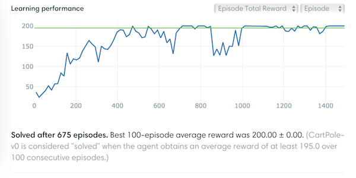

# Monte-Carlo Policy Gradient (REINFORCE)

Solve the CartPole-v0 with Monte-Carlo Policy Gradient (REINFORCE)!

## How does it work

Take a look at the boxed pseudocode below.

 : return (cumulative discounted **reward**) following time T

) : **probability** of taking action  in state 

My interpretation of this method is that the actions selected more frequently are the more beneficial choices, thus we try to repeat these actions if similar states are visited.

## Result

## Note

The box pseudocode is from [Reinforcement Learning: An Introduction](http://incompleteideas.net/sutton/book/the-book-2nd.html) by [Richard S. Sutton](http://incompleteideas.net/sutton/index.html) and [Andrew G. Barto](http://www-anw.cs.umass.edu/%7Ebarto/).

In my code, the loop of updating weights iterates from  to , and the cumulative discounted reward is computed by .

Besides, the  term is ommited in ).

Since the optimizer will minimize the loss, we will need to multiply the product of  and ) by .
